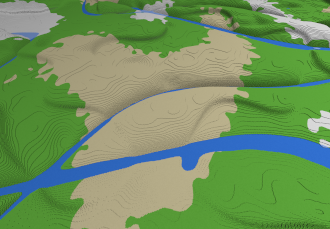
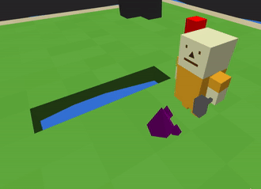

# Wonder

### My project in progress

Pure WebGL2 and Typescript project. Plan is to make a game out of it, currently it's kind of simulation, where units can
walk, find paths, mine and pick up items. There is also an option to use procedurally generated world.

You can save and load worlds from file and IndexedDB.

Project uses SharedArrayBuffers and two Workers: one for rendering with OffscreenCanvas and another one for state
updates. All animations are performed in shaders written in GLSL.

Project is publicly available and uses Continuous Deployment on GCP.

